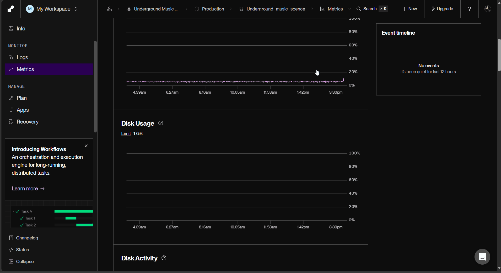

# WEB103 Project 3 - *Riff Road*

Submitted by: **Christian Gomez**

About this web app: **Riff Road is a virtual community space for fans of the European metal underground. The front page is a road map of Europe with a tour route connecting five venues, one in each corner of the scene: The Foundry (Sheffield, metalcore), Neon Bunker (Berlin, electronic metalcore and post-black), Norrland Forge (Umeå, djent and prog), The Frozen Chapel (Jyväskylä, doom and blackgaze) and Le Sanctuaire (Bayonne, prog death and blackgaze). Clicking a stop on the map opens that venue's page with its shows, listening sessions and workshops, pulled from a PostgreSQL database on Render through an Express API.**

Time spent: **7** hours

## Required Features

The following **required** functionality is completed:

<!-- Make sure to check off completed functionality below -->

- [x] **The web app uses React to display data from the API**
- [x] **The web app is connected to a PostgreSQL database, with an appropriately structured Events table**
  - [x]  **NOTE: Your walkthrough added to the README must include a view of your Render dashboard demonstrating that your Postgres database is available**
  - [ ]  **NOTE: Your walkthrough added to the README must include a demonstration of your table contents. Use the psql command 'SELECT * FROM tablename;' to display your table contents.**
- [x] **The web app displays a title.**
- [x] **Website includes a visual interface that allows users to select a location they would like to view.**
  - [x] *Note: A non-visual list of links to different locations is insufficient.* 
- [x] **Each location has a detail page with its own unique URL.**
- [x] **Clicking on a location navigates to its corresponding detail page and displays list of all events from the `events` table associated with that location.**

The following **optional** features are implemented:

- [ ] An additional page shows all possible events
  - [ ] Users can sort *or* filter events by location.
- [ ] Events display a countdown showing the time remaining before that event
  - [ ] Events appear with different formatting when the event has passed (ex. negative time, indication the event has passed, crossed out, etc.).

The following **additional** features are implemented:

- [x] Custom SVG road map of Europe (generated from public domain Natural Earth data) with a curved tour route, city labels, compass and legend, replacing the starter image
- [x] Each location has its own accent color, used on its map pin, page header and event cards
- [x] One dynamic route (`/:slug`) serves every location page, so adding a location to the database doesn't require new frontend routes
- [x] Map stops can be opened with the keyboard (Tab, then Enter or Space)
- [x] Loading and error states, including a "Location not found" page for unknown URLs
- [x] Responsive layout that works on phone screens, with a list of tour stops under the map for easier tapping
- [x] `npm run reset` script that recreates and reseeds the `locations` and `events` tables
- [x] Band photos resized and compressed for fast loading

## Database Structure

**locations**

| Column | Type | Notes |
|---|---|---|
| id | SERIAL | Primary key |
| slug | VARCHAR(50) | Unique, used in the page URL (e.g. `/sweden`) |
| name | VARCHAR(100) | Venue name |
| city | VARCHAR(100) | |
| country | VARCHAR(100) | |
| description | TEXT | |
| image | TEXT | Image URL |

**events**

| Column | Type | Notes |
|---|---|---|
| id | SERIAL | Primary key |
| title | VARCHAR(200) | |
| date | TIMESTAMP | Date and start time |
| image | TEXT | Image URL |
| location_id | INTEGER | Foreign key to `locations.id` |

## API Endpoints

| Endpoint | Returns |
|---|---|
| `GET /api/locations` | All locations |
| `GET /api/locations/:slug` | One location |
| `GET /api/locations/:slug/events` | All events at one location |
| `GET /api/events` | All events, with venue names |
| `GET /api/events/:id` | One event |

## Video Walkthrough

Here's a walkthrough of implemented required features:

Render dashboard for the Postgres database, showing live metrics and the `locations` and `events` tables:

<!-- Replace this with whatever GIF tool you used! -->
GIF created with N-Studio
<!-- Recommended tools:
[Kap](https://getkap.co/) for macOS
[ScreenToGif](https://www.screentogif.com/) for Windows
[peek](https://github.com/phw/peek) for Linux. -->

## Notes

- Connecting to Render from my laptop required the database's **external** hostname. The internal hostname only works for services running inside Render.
- ES module imports run before the rest of `server.js`, so `.env` has to be loaded inside `database.js` (through `config/dotenv.js`). Otherwise the database pool is created before the environment variables exist.
- The starter's front page used polygons traced over a photo. I replaced it with an SVG map so the five stops could be placed by real map coordinates.
- Event venues are fictional. The bands are real, and the events are imagined shows in an imagined tour.

## Credits

- Map data: [Natural Earth](https://www.naturalearthdata.com/) via [world-atlas](https://github.com/topojson/world-atlas) (public domain)
- Band photos (resized for the web):
  - [Cult of Luna, Peace and Love 2009](https://commons.wikimedia.org/wiki/File:Cult_of_Luna,_Peace_and_Love_2009.jpg) by Calle Eklund/V-wolf, [CC BY-SA 3.0](https://creativecommons.org/licenses/by-sa/3.0/), via Wikimedia Commons
  - [Gojira, Hellfest 2022](https://commons.wikimedia.org/wiki/File:Gojira_Hellfest_2022.jpg) by Bruno Bamdé, [CC BY-SA 4.0](https://creativecommons.org/licenses/by-sa/4.0/), via Wikimedia Commons
  - [Swallow the Sun, Wave-Gotik-Treffen 2016](https://commons.wikimedia.org/wiki/File:Swallow_the_Sun_Wave-Gotik-Treffen_2016_05.jpg) by S. Bollmann, [CC BY-SA 4.0](https://creativecommons.org/licenses/by-sa/4.0/), via Wikimedia Commons
  - Bring Me The Horizon: *source link here*
  - Alcest: *source link here*

## License

Copyright 2026 Christian Gomez

Licensed under the Apache License, Version 2.0 (the "License"); you may not use this file except in compliance with the License. You may obtain a copy of the License at

> http://www.apache.org/licenses/LICENSE-2.0

Unless required by applicable law or agreed to in writing, software distributed under the License is distributed on an "AS IS" BASIS, WITHOUT WARRANTIES OR CONDITIONS OF ANY KIND, either express or implied. See the License for the specific language governing permissions and limitations under the License.
